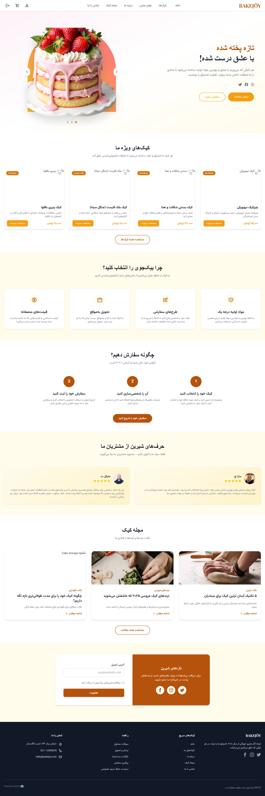
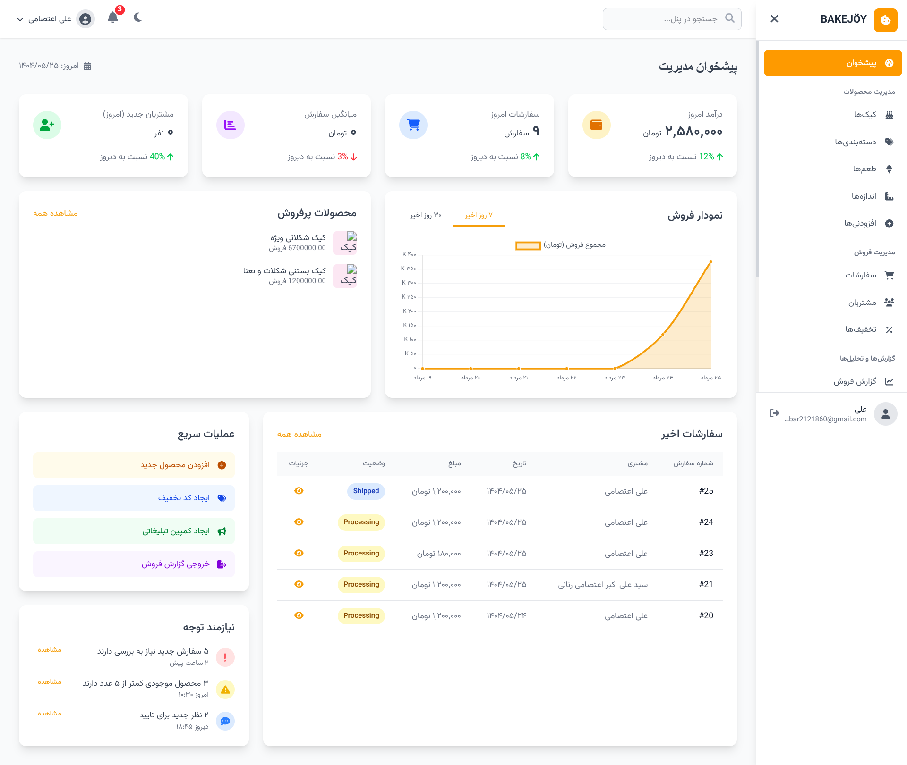
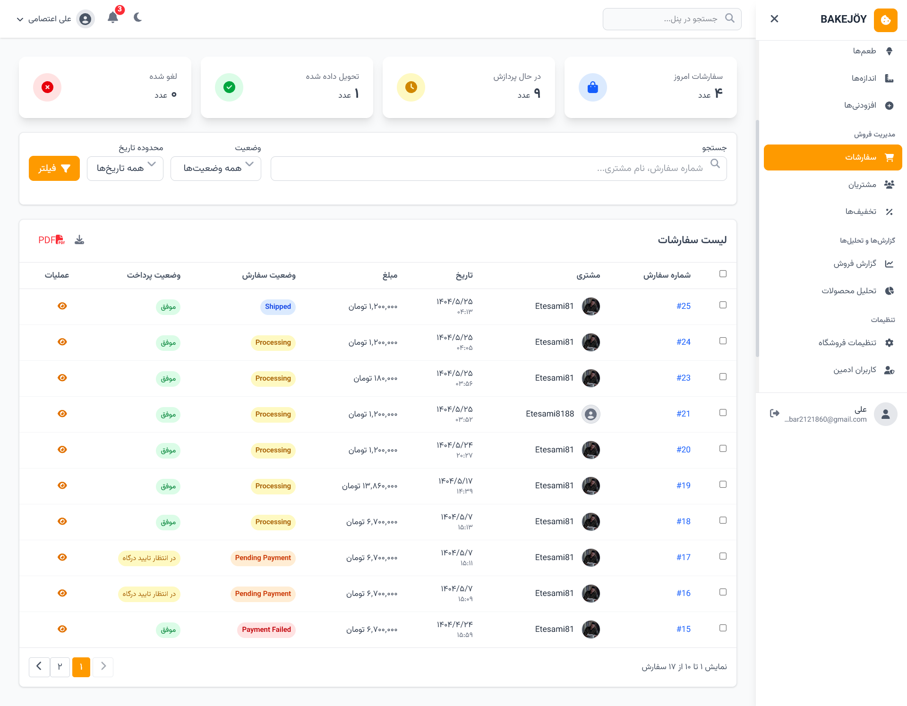
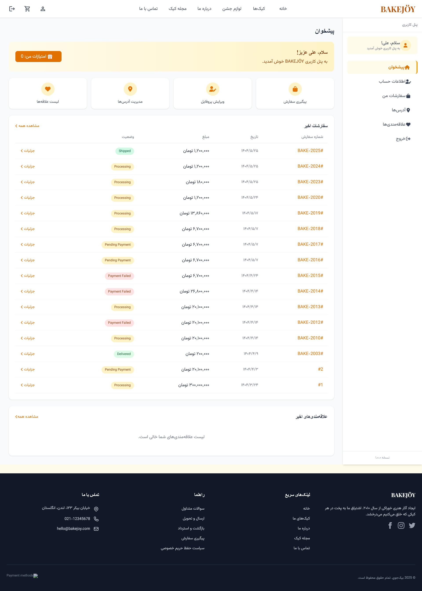

# BakeJoy — فروشگاه اینترنتی کیک و لوازم جشن

یک سامانه کامل فروش آنلاین کیک و اکسسوری‌های جشن با **Front-end جدا از Back-end**، احراز هویت **JWT**، درگاه پرداخت (زرین‌پال) و ارسال پیامک (SMS.ir).

> این ریپو شامل دو پوشه‌ی اصلی است:  
> `frontend-cake-shop/` (React + Vite + TypeScript + MUI + Tailwind)  
> `online-cake-shop/` (Django + DRF + PostgreSQL)

---

## فهرست مطالب
- [ویژگی‌ها](#ویژگیها)
- [معماری و فناوری‌ها](#معماری-و-فناوریها)
- [پیش‌نیازها](#پیشنیازها)
- [نصب و اجرا](#نصب-و-اجرا)
  - [راه‌اندازی Backend](#راهاندازی-backend)
  - [راه‌اندازی Frontend](#راهاندازی-frontend)
- [پیکربندی متغیرهای محیطی](#پیکربندی-متغیرهای-محیطی)
- [ساختار پوشه‌ها](#ساختار-پوشهها)
- [خلاصه APIها](#خلاصه-apiها)
- [تست و اعتبارسنجی](#تست-و-اعتبارسنجی)
- [نقشه راه](#نقشه-راه)
- [مشارکت](#مشارکت)
- [مجوز](#مجوز)

---

## ویژگی‌ها
- احراز هویت مبتنی بر **JWT** (ورود/ثبت‌نام، رفرش توکن، نقش‌ها و دسترسی‌ها)
- کاتالوگ محصولات: **کیک، طعم، اندازه، تگ، تصویر، لوازم جشن**
- جست‌وجو و فیلتر (دسته‌بندی، طعم، اندازه، رنگ، تم)
- مدیریت سبد خرید، لیست علاقه‌مندی‌ها، سفارش و پرداخت
- زیرساخت پرداخت آنلاین (**زرین‌پال**) و ارسال اطلاع‌رسانی پیامکی (**SMS.ir**)
- پنل ادمین برای مدیریت محصولات، سفارش‌ها و موجودی
- طراحی واکنش‌گرا با **MUI** و **TailwindCSS**
- APIهای RESTful با **Django REST Framework**
- پایگاه داده **PostgreSQL** و مهاجرت‌های دیتابیس

---

## معماری و فناوری‌ها
- **Frontend:** React (Vite + TypeScript)، React Router، MUI، TailwindCSS، Axios  
- **Backend:** Django، Django REST Framework، SimpleJWT، Django Filters  
- **Database:** PostgreSQL  
- **Auth:** Access/Refresh JWT، محافظت از مسیرها در فرانت‌اند  
- **3rd Party:** Zarinpal (Payment Gateway)، SMS.ir (Messaging)  
- **Dev Tools:** Prettier/ESLint، dotenv  

---

## پیش‌نیازها
- Node.js 18+ و pnpm یا npm  
- Python 3.10+ و pip  
- PostgreSQL 13+  
- (اختیاری) Docker و Docker Compose  

---

## نصب و اجرا

### راه‌اندازی Backend
```bash
cd online-cake-shop

python -m venv .venv
source .venv/bin/activate   # Linux/Mac
.venv\Scripts\activate      # Windows

pip install -r requirements.txt

python manage.py migrate
python manage.py createsuperuser

python manage.py runserver 0.0.0.0:8000
```

### راه‌اندازی Frontend
```bash
cd frontend-cake-shop

npm install
npm run dev
```






